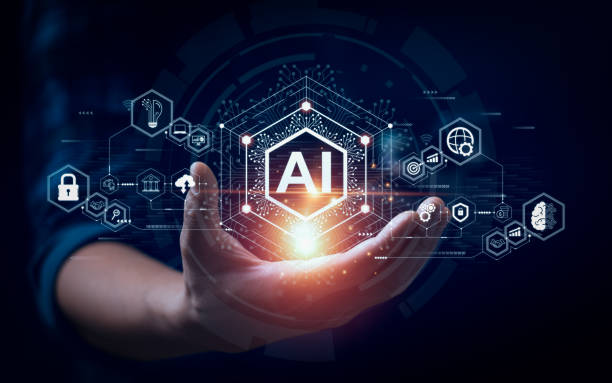

# Yapay Zeka ve Gelecek

**Yazar:** İlayda Şenocak  
**Tarih:** 1 Mart 2024  
**Kategori:** Teknoloji

Yapay zeka teknolojileri hayatımızı her geçen gün daha fazla etkiliyor. Peki bu değişim bizi nereye götürüyor? Bu yazıda, yapay zekanın günlük hayatımıza olan etkilerini ve gelecekte bizi bekleyen değişimleri detaylı bir şekilde inceliyoruz.

## Yapay Zekanın Günümüzdeki Etkileri

Günümüzde yapay zeka teknolojileri birçok alanda kullanılıyor:

- Sağlık sektöründe hastalık teşhisi
- Eğitimde kişiselleştirilmiş öğrenme
- İş dünyasında otomasyon sistemleri
- Günlük hayatta akıllı asistanlar

## Gelecekte Bizi Neler Bekliyor?

Yapay zeka teknolojilerinin gelecekte hayatımızı nasıl değiştireceğine dair öngörüler:

1. Tam otonom araçlar
2. Kişiselleştirilmiş tıp uygulamaları
3. Akıllı şehirler
4. İş dünyasında köklü değişimler

## Sonuç

Yapay zeka teknolojileri, hayatımızı kolaylaştırma potansiyeline sahip olmakla birlikte, beraberinde bazı etik soruları da getiriyor. Bu teknolojileri doğru şekilde yönetmek ve insanlık yararına kullanmak, geleceğimiz için kritik önem taşıyor.
